# Single-cell atlas analysis to reveal fibroblast state transitions and immune landscape in BRCA1-mutant human breast tissue
## Introduction
A common mutation that occurs in cancer is the BRCA1 mutation however, its role in the tumor microenvironment is poorly misunderstood. Specifically in breast cancer, the presence of a BRCA1 mutation significantly increases a patient's susceptibility to the disease, and recent investigations have documented a notable prevalence of pre-cancer associated fibroblasts (pre-CAFs) within the stroma (Buechler et al. 2023). In terms of the immune infiltration, we see that BRCA1 wild-type patients experienced increased macrophage infiltration and dendritic cell tolerance (Sun et. al 2025). But, we do not know if specific subtypes of immune cells are also involved. 

We propose a single-cell analysis using R tools such as Seurat, MiloR and Monocle on the integrated human breast cancer atlas (iHBCA). Using these, would address some of the main questions in BRCA1 carriers and will be broken down into 2 sections: 1) Fibroblast subclustering and 2) immune landscape classification. The main questions we want to address for the fibroblasts are: Do preCAFs activate markers of the DNA damage response? Do preCAFs activate markers of NF-kB and the NF-kB DDR axis? For the immune landscape we want to answer: Do macrophages express exhaustion markers in BRCA1 mutation carriers? MDSCs? Neutrophils? macrophages etc? And what is their ISG/IFN expression in BRCA1 mutation carriers vs noncarriers? The single-cell dataset is publicly available here:
https://cellxgene.cziscience.com/collections/48259aa8-f168-4bf5-b797-af8e88da6637. The external datasets used were for markers and updated data using our analysis on existing papers adressed in each section. Full analysis can be completed without re-running cellranger as that was used to enhance the results.

## Methods
### Preprocessing
Before analyzing the dataset, we needed to preprocess it. A set of samples from the iHBCA dataset were developed in house, Kessenbrock lab, and we needed to reprocess it for some additional samples which involved using CellRanger (Zheng 2017) from the raw fastqs. CellRanger essentially takes the raw reads and converts them into a count matrix for expression. Due to the sheer volume of memory needed, I had to use slurm and chunking to divide up fastqs among multiple runs. Additionally, I had to use multi-thredding to run multiple processes simultaneously. I used cellranger count specifically which does alignment between R1 and R2 reads against a reference, then it identifies barcodes which are the molecular tag for each droplet. It then does UMI counting to counter deduplication and finally creates the counts matrix. I then gather those samples together and perform an integration with the overall dataset. Integration involves taking multiple different samples and projecting them onto a common latent space to observe conserved biology between cell types. The cell ranger script can be found in run_cellranger.sub the fastqs are not provided due to the size and unpublished data, however the full analysis can be completed just using HBCA. Additionally, the cellranger output was combined in the merge_cr.R. 

CellbyGene posts the UMAP of the whole object shown in figure 1, but since we are looking at specific populations, we take the specific dataset for the cell types of interest. 

<figure>
  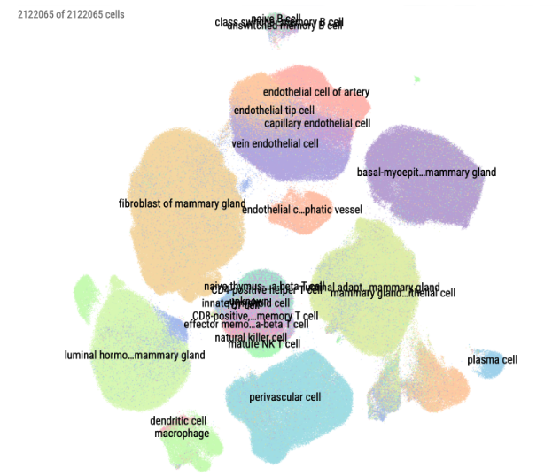
  <figcaption>Integrated UMAP from HBCA showing all of the cell types.</figcaption>
</figure>

The full fibroblast analysis can be found in fibroblast_analysis.R and the immune analysis can be found in immune_analysis.R.

### Subclustering
From the HBCA dataset, we take only the stromal cells for the first part of the analysis. The dataset is then integrated with the fibroblasts from the processed samples using the basic Seurat pipeline with Harmony integration. This involves running Harmony integration using the donor id as the batch key and running ScaleData, RunPCA, RunUMAP, FindNeighbors and FindClusters. Once subsetting the fibroblasts, we filtered out technical artifacts like ribosomal clusters, mitochondrial clusters and clusters with low counts and re-integrated to get an object of mixed fibroblasts. Figure 2 shows the UMAP of the fibroblasts. 

<figure>
  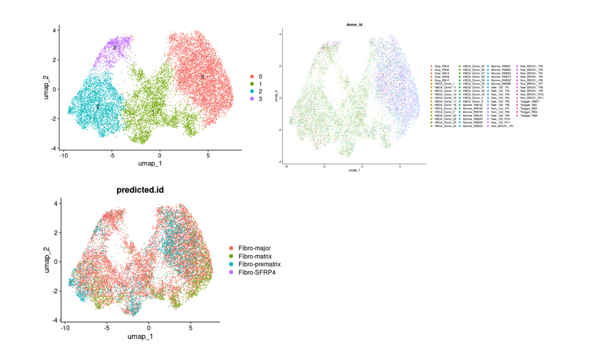
  <figcaption>a) shows the fibroblast clusters at a resolution of 0.2, b) shows the split by patient for the subsetted fibroblasts, c) shows the label transferred fibroblasts.</figcaption>
</figure>

Using the following paper, we want to classify cell states for the fibroblasts: Fibro-major, Fibro-SFRP4. Fibro-matrix and Fibro-prematrix (Nee 2023). For this I attempted to do a module score using the marker genes from the paper, however the transfer was too mixed within the fibroblast subcluster. I then transitioned my approach to a more supervised way of using scvi along with scArches (Lotfollahi 2022). scVI trains a variational autoencoder on the reference dataset to capture biological variation then I used scANVI to incorporate cell type labels to really separate out the latent space. Then I used scArches to take the pretrained weights and perform transfer learning to take the HBCA fibroblast cells and project them into the same latent space as the reference (Broustas 2024). Once this is complete, we can see the fibroblast cell states separate cleanly shown in figure 3. The scripts for this are first running scvi_scanvi_integration.py then label_transfer.py. Conversion between python representation of single cell objects (h5ad) and rds was done using SeuratDisk for conversion to h5ad and zellkonverter for conversion to rds. 

<figure>
  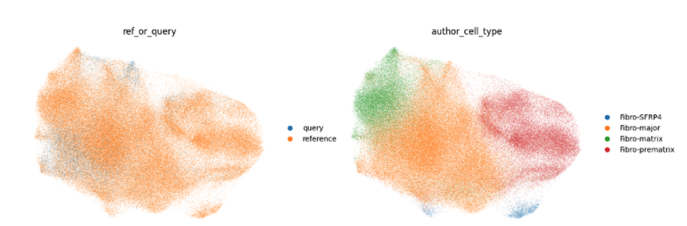
  <figcaption>a) shows the integration between reference (Nee et al. 2023) and query (HBCA fibroblasts) and b) shows the projection of the cell states. A similar approach was taken for the macrophage population as well.</figcaption>
</figure>

### Differential Abundance Testing
We used MiloR (Dann et al. 2022) to perform the differential abundance testing across the various samples and the experimental controls of BRCA carrier vs control. We first built the k-nearest neighbors graph and defined neighborhoods as a group of cells connected by an edge to the target cell in the overall KNN graph. We then define the experimental design looking primarily at the differential abundance between BRCA carriers and controls. We then count how many cells are from each sample for each neighborhood in order to keep track of the variation in cell numbers between replicates of the same experimental condition. Then using the calcNhoodDistance function to store the distances between nearby neighbors in the Milo graph. With all of these processes, we finally perform the differential abundance testing using testNhoods. From this test, Milo generates a fold change and corrected p-value for each neighborhood indicating significant differential abundance. We then assigned a grouping method to find the most abundant cell state within each neighborhood, as they can tend to be heterogeneous among cell states. The most significant neighborhood groups were filtered by edgeR’s quasi-likelihood F-test and a cutoff of P < 0.05.

## Results
### Fibroblast Analysis
We then have to find pre-CAFs from this in order to compare cell states down the line. We use marker genes from literature and our analysis stored in the data folder. Using those genes, we module score the new object and calculate the pre-CAF concentration. Figure 4 shows the pre-CAFs on the UMAP space.

<figure>
  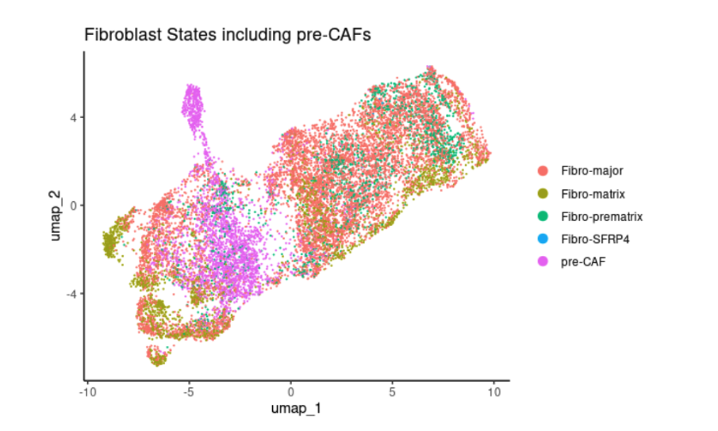
  <figcaption>Integrated UMAP with pre-CAF population being shown</figcaption>
</figure>

We can see a more distinct population of the pre-CAFs compared to the other cell states. Fibro-prematrix in Seurat UMAP looks different compared to the scvi representation, but it seems like fibro-major is mixed throughout which correlates as its the most abundant cell state that differentiates into other states. Fibro-matrix primarily outlines the cells, Fibro-prematrix is predominantly on the right side of the UMAP and Fibro-SFRP4 is mixed with the pre-CAFs.

We also test differential abundance of the different fibroblast cell states to observe which states are more differentially abundant in BRCA. We can see from figure 5 that fibro-major and fibro-matrix are pretty even across all conditions, but pre-CAFs are significantly enriched in BRCA carrier

<figure>
  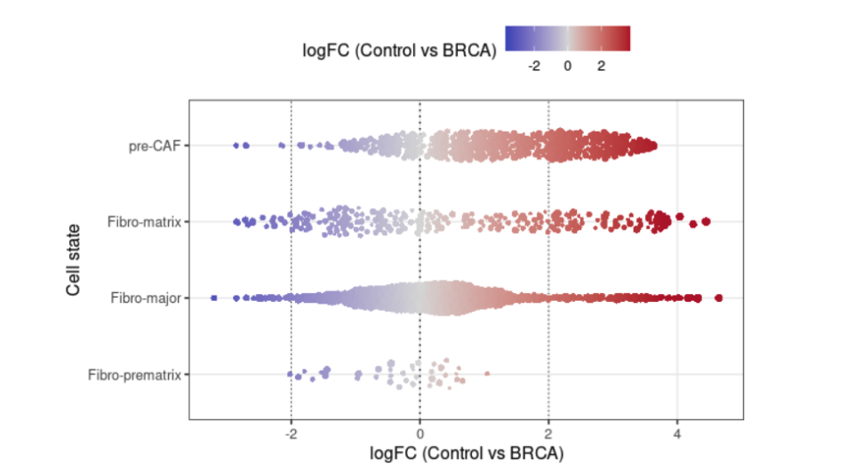
  <figcaption>Milo beeswarm plot showing differential abundance</figcaption>
</figure>

We also test differential abundance of the different fibroblast cell states to observe which states are more differentially abundant in BRCA. We can see from figure 5 that fibro-major and fibro-matrix are pretty even across all conditions, but pre-CAFs are significantly enriched in BRCA carriers.

Once we obtain all of the fibroblast states, we look into what kind of DNA damage markers are expressed by the pre-CAFs. BRCA1-deficient cells are generally more susceptible to DNA damage indicating a connection between BRCA1 and DNA repair and more expression of repair genes in BRCA carriers (Jang 2004).

For this we create dot plots collecting the major genes literature (Broustas 2014) shown in figure 6. From this we observe that PARP1 is significantly more expressed in pre-CAFs compared to the other cell states. PARP1 codes for an enzyme that repairs DNA breaks and in pre-CAFs, PARP1 becomes overexpressed to repair breaks (Helleday 2011).  This makes sense as pre-CAFs would be more responsive during their transition into CAFs. We also see this happening predominantly in the BRCA where we see darker blue circles indicating more expression. 

<figure>
  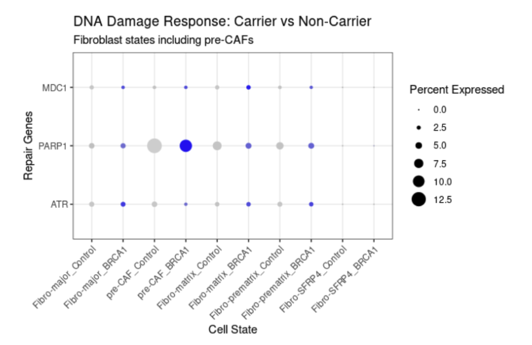
  <figcaption>Dot Plot of gene expression for fibroblasts cell states for DNA damage response markers</figcaption>
</figure>

We also wanted to look at the NF-kB axis. NF-κB is a transcription factor, which is activated in response to DNA damage. Its link to BRCA carriers is well described as NF-κB is an essential mediator of the chemoresistance typically seen in BRCA1-positive breast and ovarian cancers (Harte 2014). So we should see that NF-kB markers should be overexpressed in BRCA carriers and should correlate with DNA damage markers as an active regulator.  

<figure>
  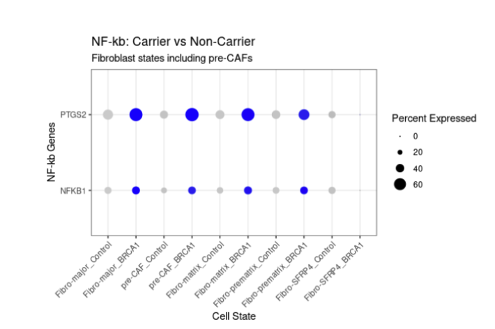
  <figcaption>Dot Plot of gene expression for fibroblast cell states and NF-kB markers.</figcaption>
</figure>

From figure 7, we clearly see an overexpression of key NF-kB markers in the BRCA carriers compared to the controls. However, we do not see much difference in terms of the expression in pre-CAFs compared to other fibroblasts. This would indicate that maybe the NF-kB markers are not specific to pre-CAFs and are more generally expressed in all fibroblasts in BRCA carriers. 

Overall, it seems like the pre-CAFs are more present and active in BRCA carriers in response to DNA damage. The correlation between DNA damage and the NF-kB axis with BRCA carriers was positive and indicates that these genes and specifically the pre-CAFs are dealing with more DNA damage in the carriers. This could be a result of BRCA1 as a DNA repair gene malfunctioning and now other genes need to take up its role.

### Immune Landscape
For the immune landscape, we isolate the macrophage population and module score for tumor associated macrophages (TAM) populations from the following paper (Ma 2022). The UMAP is shown in figure 8.

<figure>
  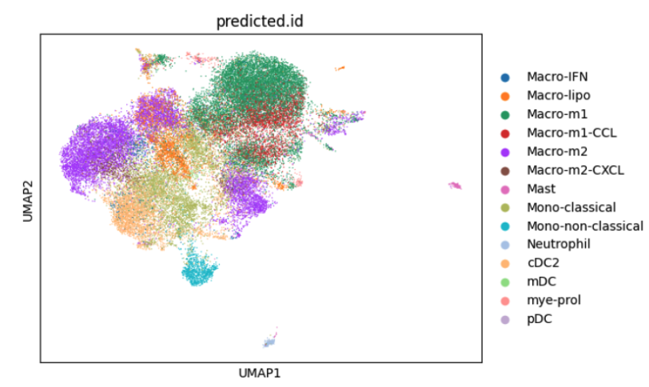
  <figcaption>UMAP of macrophage transferred cell states.</figcaption>
</figure>

We also test differential abundance of the different immune cell states to observe which states are more differentially abundant in BRCA. We can see from figure 9 that macro-m1-CCL, mono-classical and macro-m1 show a slight skew towards the controls, but there is more of a bulge in the control. This is quite unexpected as we assume that BRCA carriers are dealing with more DNA damage and their correlation with immune infiltration. However, these patients are healthy so it is also possible there is no immune infiltration in general and we can say in the BRCA carriers, the immune population is depleted as it skews towards the control.

<figure>
  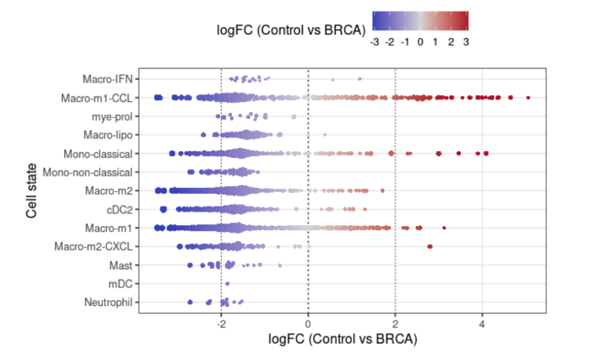
  <figcaption>Milo beeswarm plot for the immune population.</figcaption>
</figure>

We also test differential abundance of the different immune cell states to observe which states are more differentially abundant in BRCA. We can see from figure 9 that macro-m1-CCL, mono-classical and macro-m1 show a slight skew towards the controls, but there is more of a bulge in the control. This is quite unexpected as we assume that BRCA carriers are dealing with more DNA damage and their correlation with immune infiltration. However, these patients are healthy so it is also possible there is no immune infiltration in general and we can say in the BRCA carriers, the immune population is depleted as it skews towards the control.

With these clusters, we want to look at myeloid exhaustion between BRCA carriers and controls. It has been well reported that certain immune cells in breast tissue of BRCA carriers show malfunction known as exhaustion and damaged breast cells are not able to be cleared out (Reed 2024). 

We looked at exhaustion markers as well as immunosuppression markers to visualize the expression across all of the cell states. The markers used were specifically CD274, PDCD1LG2, IDO1, LAIR1, HAVCR2 which were then module scored. From figure 10, we see myeloid dendritic cells (mDCs are higher expressed in carriers as well as interferons. We also see in general other than neutrophils and pDCs there is similar or slightly more expression in carriers.

<figure>
  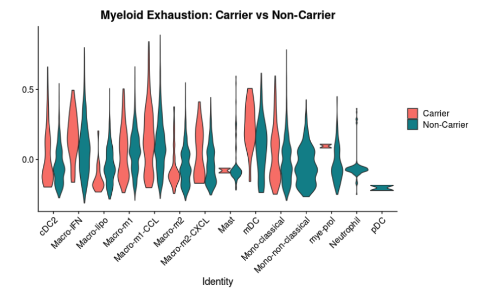
  <figcaption>Violin plots of exhaustion markers across cell states.</figcaption>
</figure>

We also look at ISG/IFN expression as well which are primarily interferon genes. We specifically use IFIT1, IFIT2, IFIT3, ISG15, OAS1, MX1. From figure 11, we see that  both BRCA carriers and non carriers have high expression, but there seems to be more of a trend upwards for higher expression for the carriers as seen in mDCs, macro-IFN and cDC2. THis suggests that these states are potentially activated by interferon signaling. 

<figure>
  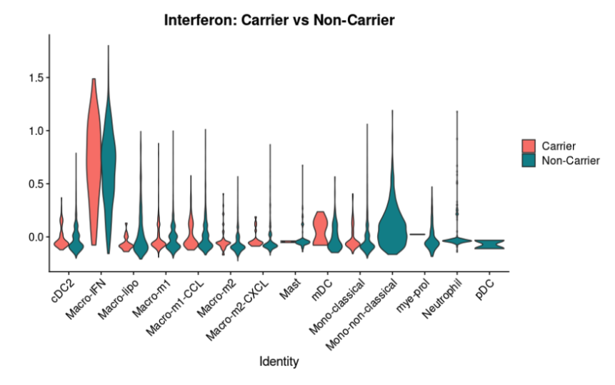
  <figcaption>Violin plots of IFN markers across cell states.</figcaption>
</figure>

Taking the full immune landscape into account, we believe that Macro-IFN and mDCs are the most active in BRCA carriers and the rest of the population is depleted needing further studies as to why.

## Discussion
The interplay between the epithelial structures and surrounding stroma is pivotal in understanding breast cancer initiation. We investigated the two major components of the stroma: fibroblasts and immune landscape. Non-carriers are generally prone to use NF-kB markers to activate anti-apoptotic genes when encountered with stress (Harte 2014). BRCA mutated cells are constantly undergoing DNA damage stress requiring more NF-kB to fix the DNA damage that is more frequent in the BRCA carriers as seen by the increased expression of DNA damage genes. Based on preliminary results, there may be a feedback loop to be investigated between the DNA damage genes and the NF-kB during BRCA carriers.

In terms of the immune population, we notice a very active but also suppressive environment in the BRCA carriers. Expression for interferon genes in Macro-IFN suggests some active response to genomic instability and additionally the upregulation in mDCs suggests suppression in the immune environment. Using both findings, we can hypothesize that defective BRCA creates a cycle of DNA damage and interferon release getting the tissue ready for tumor development. Future studies would involve investigating a potential feedback mechanism between the BRCA fibroblasts and the immune microenvironment.

In terms of technical challenges, I did not have sufficient time to encounter the transition states and differentiation using Monocle. The preprocessing steps were a challenge as labels were not transferring well to begin with leading me through many loop-holes. I hope in future work, I will use Monocle to better understand the transition from immune states and fibroblasts to pre-CAFs.

## References
Buechler MB, Fu W, Turley SJ. 2023. Healthy BRCA1/2 mutation carriers exhibit a pre-CAF signature and altered epithelial marker expression in breast tissue Scientific Reports 15(1):32736 doi:10.1038/s41598-025-18171-y

Dann, E., Henderson, N.C., Teichmann, S.A. et al. Differential abundance testing on single-cell data using k-nearest neighbor graphs. Nat Biotechnol 40, 245–253 (2022). https://doi.org/10.1038/s41587-021-01033-z

Zheng, G., Terry, J., Belgrader, P. et al. Massively parallel digital transcriptional profiling of single cells. Nat Commun 8, 14049 (2017). https://doi.org/10.1038/ncomms14049
Nee, K., Ma, D., Nguyen, Q.H. et al. Preneoplastic stromal cells promote BRCA1-mediated breast tumorigenesis. Nat Genet 55, 595–606 (2023). https://doi.org/10.1038/s41588-023-01298-x

Lotfollahi, M., Naghipourfar, M., Luecken, M.D. et al. Mapping single-cell data to reference atlases by transfer learning. Nat Biotechnol 40, 121–130 (2022). https://doi.org/10.1038/s41587-021-01001-7

Broustas, C. G., & Lieberman, H. B. (2014). DNA damage response genes and the development of cancer metastasis. Radiation research, 181(2), 111–130. https://doi.org/10.1667/RR13515.1

Mussbacher M, Derler M, Basílio J and Schmid JA (2023) NF-κB in monocytes and macrophages – an inflammatory master regulator in multitalented immune cells. Front. Immunol. 14:1134661. doi: 10.3389/fimmu.2023.1134661

Helleday T. (2011). The underlying mechanism for the PARP and BRCA synthetic lethality: clearing up the misunderstandings. Molecular oncology, 5(4), 387–393. https://doi.org/10.1016/j.molonc.2011.07.001

Sun S, Chen S, Li K, Zhang G, Wang N, Xu Y, Wang X, Chi J, Li L and Sun Y (2025) Resolving tumor microenvironment heterogeneity to forecast immunotherapy response in triple-negative breast cancer through multi-scale analysis. Front. Oncol. 15:1538574. doi: 10.3389/fonc.2025.1538574

Jang, E. R., & Lee, J. S. (2004). DNA damage response mediated through BRCA1. Cancer research and treatment, 36(4), 214–221. https://doi.org/10.4143/crt.2004.36.4.214

Harte, M. T., Gorski, J. J., Savage, K. I., Purcell, J. W., Barros, E. M., Burn, P. M., McFarlane, C., Mullan, P. B., Kennedy, R. D., Perkins, N. D., & Harkin, D. P. (2014). NF-κB is a critical mediator of BRCA1-induced chemoresistance. Oncogene, 33(6), 713–723. https://doi.org/10.1038/onc.2013.10

Ma, Ruo-Yu, Annabel Black, and Bin-Zhi Qian. "Macrophage diversity in cancer revisited in the era of single-cell omics." Trends in immunology 43.7 (2022): 546-563.

Reed, A.D., Pensa, S., Steif, A. et al. A single-cell atlas enables mapping of homeostatic cellular shifts in the adult human breast. Nat Genet 56, 652–662 (2024). https://doi.org/10.1038/s41588-024-01688-9
