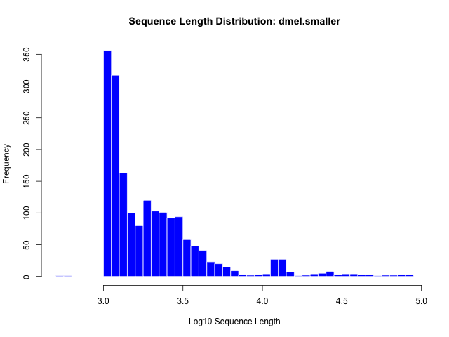
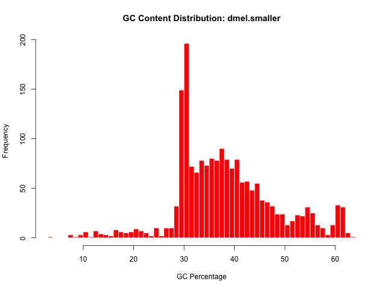
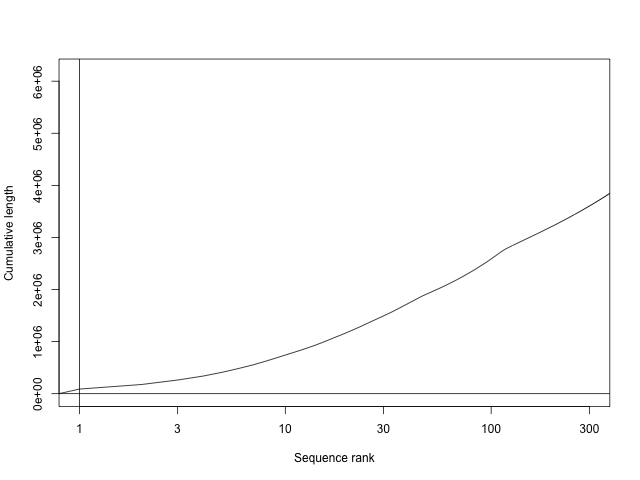
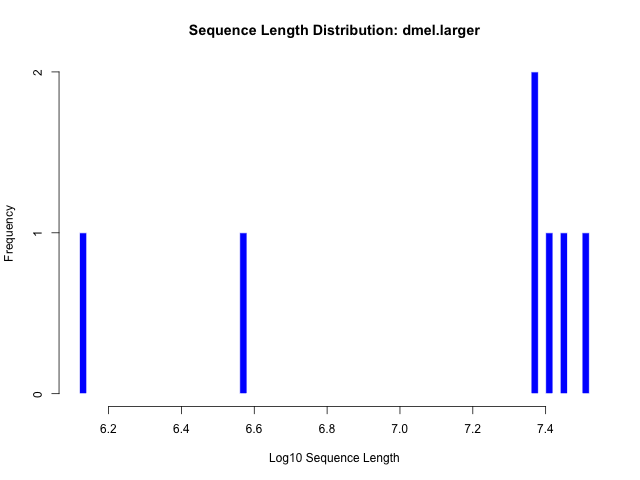
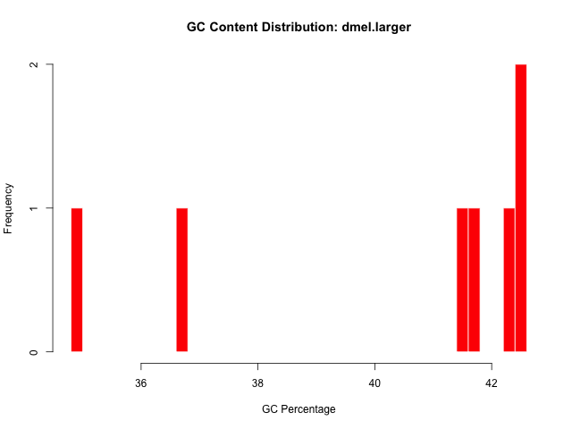
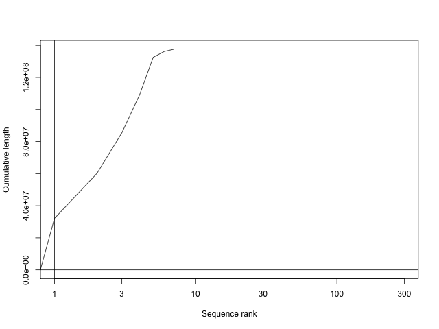
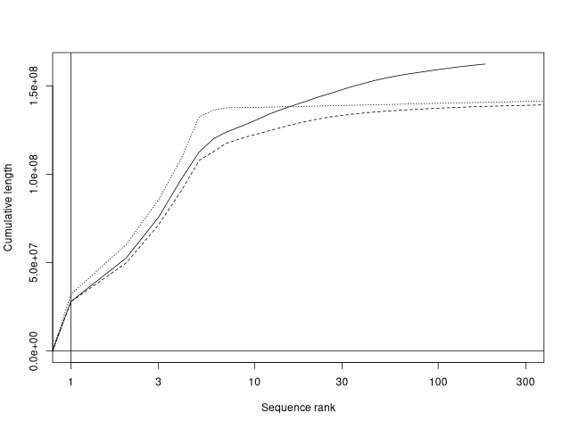

# Genome Assembly
## Summarize each partition
Using faSize, I was able to compute the following for each partition.
### Partition <= 100kb
1. There are 6178042 nucleotides in this partition.
2. There are 662593 Ns.
3. There are 1863 sequences.

### Partition > 100kb
1. There are 137057575 nucleotides.
2. There are 490385 Ns.
3. There are 7 total sequences.

## Plots for sequences
### Partition <= 100kb
When looking at the sequence length distribution, we can create a histogram. To obtain the data, I used bioawk to obtain information from each partition like total number of bases and total gaps (N). We then create an R script to make the histogram by using `length($seq)` counts every character between fasta headers. 

When for the gc content, we also calculate that with bioawk specifically taking the gc bases and dividing it by the total number of bases. 

Finally, using plotCDF we take the lengths from our bioawk output to show the cumulative sequence size. 

### Partition > 100kb
When looking at the sequence length distribution, we can create a histogram. To obtain the data, I used bioawk to obtain information from each partition like total number of bases and total gaps (N). We then create an R script to make the histogram by using `length($seq)` counts every character between fasta headers. 

When for the gc content, we also calculate that with bioawk specifically taking the gc bases and dividing it by the total number of bases. 

Finally, using plotCDF we take the lengths from our bioawk output to show the cumulative sequence size. 

### Comparision
The larger partition (> 100kb) has a much steeper initial size which correlates with a few large pieces. The smaller one is a lot more gradual and shows smaller fragments. The histograms show 7 distinct bars which correlates with 7 drosophilla chromosomes for the larger one and the smaller one shows  more of the lower quality smaller fragments. The smaller gc plot shows more variability and looks messier compared to the larger one which is around 40ish percent.

# PacBio HiFI
1. When calculating N50, it involves getting the length of the shortest contig that all contigs of that length or longer sum up to at least 50% of the full assembly size. For this, I sorted all of the sequences by size in decending order. I then used awk to store every length in an array and summing it up. All while checking to see if the cumulative sum is greater or equal to half of the assembly. From this analysis I got 21,715,751 as the N50. The actual reference is 25.3 Mb which is pretty comparable to this. 

2. I then compare the cumulative sequence length of the scaffolds and contig assembly from the dmel assembly with the HiFi assembly. Each pipe corresponds to the 3 assemblies (HiFi, contigs and scaffolds). We end up getting the following plot: . 

The reference scaffolds and HiFi assembly are almost overlapping and shoot up in the early parts of the plot.

3. Using compleasm to calculate BUSCO scores, we deduced for the HiFi assembly there was a 99.77% completeness, 99.43% single copy, 0.34% duplicated, 0.16% fragmented and 0.08% of genes missing. For the FlyBase reference, there was 99.84% complete, 99.45% single copy, 0.39% duplicated, 0.16% framgented and no missing genes. The assembly seems to be of high quality only missing (0.08%) of genes which is quite nice and the low duplication rate indicates that the 2 parental hapolotypes were compressed into a single representative sequence. 
